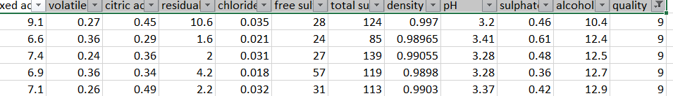
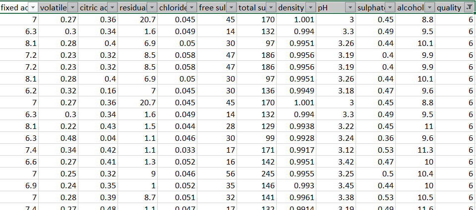

## Artifical Intelligence Project: Predicting Wine Quality

**Project description:** This project involved using Python with Keras to build a classification model that will predict the wine quality based on the 11 different wine attributes for Portuguese "Vinho Verde" wine.

### 1.	Data Used:
The data that was used to create this neural network was retrieved from the UCI Machine Learning Repository. This data from the “winequality-white.csv” included information on the white variants of the Portuguese "Vinho Verde" wine. This data set included 11 different columns of various wine attributes such as fixed acidity, volatile acidity, citric acidity, residual sugar, chlorides, free sulfur dioxide, total sulfur dioxide, density, pH, sulphates and alcohol level. The 12th column consisted of the quality of the wine.

### 2.	Objective:
The objective of creating this neural network is to build a classification model that will predict the wine quality based on the 11 different wine attributes. The quality of the wine is ranked from 0 to 10 with 0 being the lowest and 10 being the highest. The goal is to train the neural network so that it can learn which attributes result in the overall quality score. The model that produces the highest accuracy will be the model considered the most efficient model. 
To measure how well our model is performing we will create a training and test set sample from the wine data set. We will then measure how well our training model fits our test model by using the categorical crossentrophy and accuracy metric. The categorical crossentrophy metric will tell us how often our model classified the right quality level or not. We will also be using a confusion matrix to see which quality ratings were being predicted more correctly than others. The accuracy metric is also included in this model to assess the overall accuracy rate of predicted classifications.

### 3.	Input variables explanation / preprocessing steps:
The input variables that were used came from the winequality-white.csv file. The independent variables are the first 11 columns which are the wine attributes. These are the 11 columns that I subset into its own x variable to later scale.
I also separated out the dependent variable, y, to use in the model to predict its accuracy. The last column is wine quality which is the dependent variable we are using to access how our model is performing. Since this is a classification problem, it is necessary to turn the wine quality feature into a categorical feature. 
 
The to_categorical function allows us to take each number that is in the quality column and turn it into a binary factor of 1 and 0 for every wine quality rating. This allows our model to better understand when it wrongly predicts the wine quality rating. 
 
Before running the model, it was also important to scale the features of the different wine attributes. If we were to run the model without scaling these x’s then, the model would believe that the larger numbers are more important. We scale the data to ensure that one column is not favored largely over the other. 
###  4.	Metric Explanation and Justification:
I chose to measure how well my neural network was performing by using the categorical crossentropy and accuracy metric. The categorical crossentropy metric would allow me to understand how often my training model was correctly classifying the training set wine qualities to the wine qualities test set. I didn’t really use this metric as a hard determinant with how well my model was performing but, instead used it as a loss function to understand what number of each classification was being calculated correctly.
Since this is a classification problem, accuracy was a more useful metric in determining if my model was correctly predicting the wine quality class or not.
It was also important to include a confusion matrix with my neural network classification model. Accuracy measures the overall corrected predictions but, a confusion matrix allows us to tell if the model is predicting one number more than other numbers. A model that has similar incorrect predictions across all of the different classes is a good model but, a model with great accuracy with one class and terrible at all the other classes is a poor model.
*I have included a confusion matrix screenshot with every experiment I conducted.
*I have also included the metrics of my NN below in Table 1.1.

### 5.	Final ANN model code:
```python
 """""""""""""""""""""""""""""""""""""""""""""""""""""""""""""""""""""""""""
Import Libraries Section
"""""""""""""""""""""""""""""""""""""""""""""""""""""""""""""""""""""""""""
import datetime
import pandas as pd
import keras
from keras.models import Sequential
from keras.layers import Dense
import matplotlib.pyplot as plt
import numpy as np
from sklearn.preprocessing import MinMaxScaler
from sklearn.preprocessing import LabelEncoder
from sklearn.model_selection import KFold
from keras.utils import to_categorical
from sklearn.model_selection import GridSearchCV
import itertools
from sklearn.metrics import confusion_matrix
"""""""""""""""""""""""""""""""""""""""""""""""""""""""""""""""""""""""""""
Load Data Section
"""""""""""""""""""""""""""""""""""""""""""""""""""""""""""""""""""""""""""
data = pd.read_csv("winequality-white.csv", delimiter=";", header=0)
dataset = data.values
x = dataset[:,0:11] 
y = dataset[:,11]
#print(y)
"""""""""""""""""""""""""""""""""""""""""""""""""""""""""""""""""""""""""""
Pretreat Data Section
"""""""""""""""""""""""""""""""""""""""""""""""""""""""""""""""""""""""""""
np.random.seed(22)
scaler=MinMaxScaler()
x_scaled=scaler.fit_transform(x)
#print(x_scaled.shape)
cat_y = to_categorical(y)

#print(cat_y.shape)
"""""""""""""""""""""""""""""""""""""""""""""""""""""""""""""""""""""""""""
Parameters Section
"""""""""""""""""""""""""""""""""""""""""""""""""""""""""""""""""""""""""""
"""""""""""""""""""""""""""""""""""""""""""""""""""""""""""""""""""""""""""
Define Model Section
"""""""""""""""""""""""""""""""""""""""""""""""""""""""""""""""""""""""""""
start_time=datetime.datetime.now()

# create model
def create_model():
    model=Sequential()
    model.add(Dense(22, input_dim=x_scaled.shape[1], activation = 'relu'))
    model.add(Dense(15, activation = 'sigmoid'))
    model.add(Dense(11, activation = 'relu'))
    model.add(Dense(10, activation = 'softmax'))
    
    #compile network
    model.compile(optimizer='adam', loss='categorical_crossentropy', metrics = ['categorical_accuracy'])
    return model

"""""""""""""""""""""""""""""""""""""""""""""""""""""""""""""""""""""""""""
Train Model Section
"""""""""""""""""""""""""""""""""""""""""""""""""""""""""""""""""""""""""""
def plot_confusion_matrix(cm, classes,
                          normalize=False,
                          title='Confusion matrix',
                          cmap=plt.cm.Blues):
    """
    This function prints and plots the confusion matrix.
    Normalization can be applied by setting `normalize=True`.
    """
    plt.figure()
    plt.imshow(cm, interpolation='nearest', cmap=cmap)
    plt.title(title)
    plt.colorbar()
    tick_marks = np.arange(len(classes))
    plt.xticks(tick_marks, classes, rotation=45)
    plt.yticks(tick_marks, classes)

    if normalize:
        cm = cm.astype('float') / cm.sum(axis=1)[:, np.newaxis]

    thresh = cm.max() / 2.
    for i, j in itertools.product(range(cm.shape[0]), range(cm.shape[1])):
        plt.text(j, i, cm[i, j],
                 horizontalalignment="center",
                 color="white" if cm[i, j] > thresh else "black")
    plt.tight_layout()
    plt.ylabel('True label')
    plt.xlabel('Predicted label')
n_split= 5
for train_index, test_index in KFold(n_splits=n_split, shuffle=False, random_state=None).split(x_scaled):
    x_train, x_test=x_scaled[train_index], x_scaled[test_index]
    y_train, y_test=cat_y[train_index], cat_y[test_index]
    model=create_model()
    history=model.fit(x_train, y_train, batch_size=3, epochs=60, verbose=1, validation_data=(x_test, y_test))
    print('Model Evaluation Train MSE:', model.evaluate(x_train, y_train))
    print('Model Evaluation Test MSE:', model.evaluate(x_test, y_test))
    plt.figure()
    plt.plot(history.history['loss'], label='Training loss')
    plt.plot(history.history['val_loss'], label='Test loss')
    plt.title('Loss values')
    plt.ylabel('Loss value')
    plt.xlabel('Epoch')
    plt.legend(loc="upper left")
    plt.show()
    pred_label = model.predict(x_test)
    # Get classes
    pred_label_classes = np.argmax(pred_label, axis=1)
    # get true
    label_true = np.argmax(y_test, axis = 1)
    confusion_mtx = confusion_matrix(label_true, pred_label_classes)
    print(confusion_mtx)
    # Call plot confusion Matrix
    plot_confusion_matrix(confusion_mtx, classes = range(7))
"""""""""""""""""""""""""""""""""""""""""""""""""""""""""""""""""""""""""""
Show output Section
"""""""""""""""""""""""""""""""""""""""""""""""""""""""""""""""""""""""""""
stop_time = datetime.datetime.now()
print("Time required for training:", stop_time- start_time)
#print('dataset.type', dataset)
print('Model Evaluation Train Cateogrical Crossentrophy, Accuracy:', model.evaluate(x_train, y_train))
print('Model Evaluation Test Cateogrical Crossentrophy, Accuracy:', model.evaluate(x_test, y_test))
```

### 6.	Final model in words:
My final model had three hidden layers starting with 22, 15 and 11 nodes. The first hidden layers used the activation function relu. The second hidden layer used the activation function sigmoid and the third hidden layer used relu. I used the optimizer adam and calculated loss by using categorical crossentrophy and included accuracy as an added metric. I utilized a 5 K-fold cross validation method and had an 80/20% mix of training and test data. My overall test accuracy was .591.

### 7.	Training algorithm in words:
It was important to create the training and test set within the K-Fold cross validation for loop. This allowed me to specify the number of K-fold splits for the model as well as the number of training and test splits. Every model created had a training split of 80% and test split of 20%. I wanted a high training split so my model could have a larger opportunity to predict the right wine quality rating.
The training and test set for the x’s/ y’s were created from the pretreated step of the scaled x’s and converted categorical y’s. 

### 8.	Validation explanation of method chosen:
All my models used a K-fold cross validation split for the white wine data set. I kept shuffle equal to false to ensure that all the wine data was used. I was afraid if I set this to true, then some of the wine quality ratings might not be reported since there was not an even amount of wine quality ratings in the data set.
I found my best results with a K-fold split of five and found little improvement in increasing or decreasing the number. This method will ensure that four subsets of the data will be trained on the neural network with the last subset used for testing whether our model predicted the right wine quality or not.

### 9.	Objective results and Problem:
There were many problems in running my neural network as a classification model for predicting the wine quality rating. The first issue was that the data within the wine quality column did not have an even distribution of quality samples. 
   <br><br>
 
   <br><br>
In the picture above, there was only five records with a quality rating of 9 and seven records with a wine quality of 3. The wine qualities that were in the middle of 3 and 9 had a better sample size and it was easier to predict its classification. 
 <br><br>
 
Overall my model hovered around 55% to 60% accuracy which is slightly better than flipping a coin but, still not accurate enough to be highly predictive. My best model had a test accuracy of .591. If there were a more evenly distribution of sample size among the various wine qualities, then this model would have a better chance at becoming more predictive.
At first, I used the binary crossentropy loss metric and had an average accuracy over 90% but, this was very misleading. The model was measuring its loss on how well it predicted either 1 or 0 but, that is not the accuracy we wanted to measure. When I changed it to categorical crossentropy as the loss metric, this allowed me to better understand how often my model was predicting the wine quality classes.
### 10.  Final Remarks
If we were to have a larger sample size within the wine qualities on the high and low ends, then we could create a more predictive model. If this model was only used to predict wine quality classifications between four and seven, then we could generate an efficient model that predicts at a high level of accuracy.

