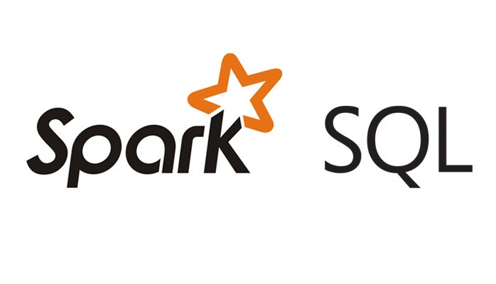

## Portfolio

---

### Category Name 1 

[Spark SQL: An Analysis of College University Data Metrics](/work-portfolio/sample_page)

---
[Artifical Neural Network: Predicting Wine Quality](/work-portfolio/AI-project)

---
[Project 3 Title](http://example.com/)

---

### Category Name 2

- [Spark SQL ](http://https://toddschaffer1.github.io/work-portfolio/spark-example/)
- [Project 2 Title](http://example.com/)
- [Project 3 Title](http://example.com/)
- [Project 4 Title](http://example.com/)
- [Project 5 Title](http://example.com/)

---

---

Page template forked from <a href="https://github.com/evanca/quick-portfolio">evanca</a>

<!-- Remove above link if you don't want to attibute -->
