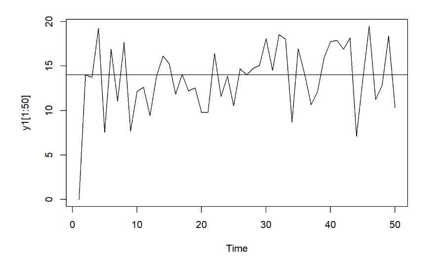
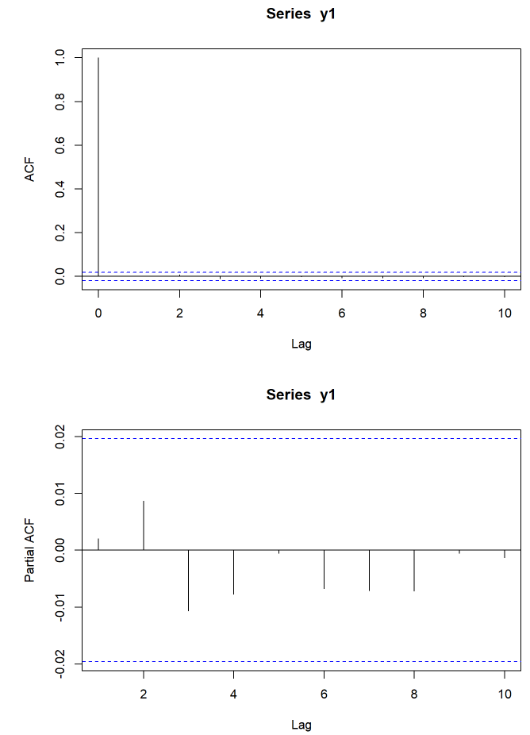
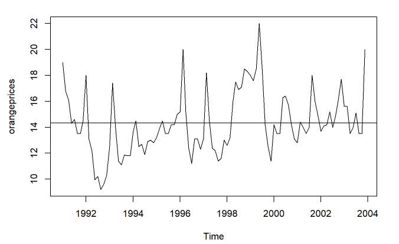
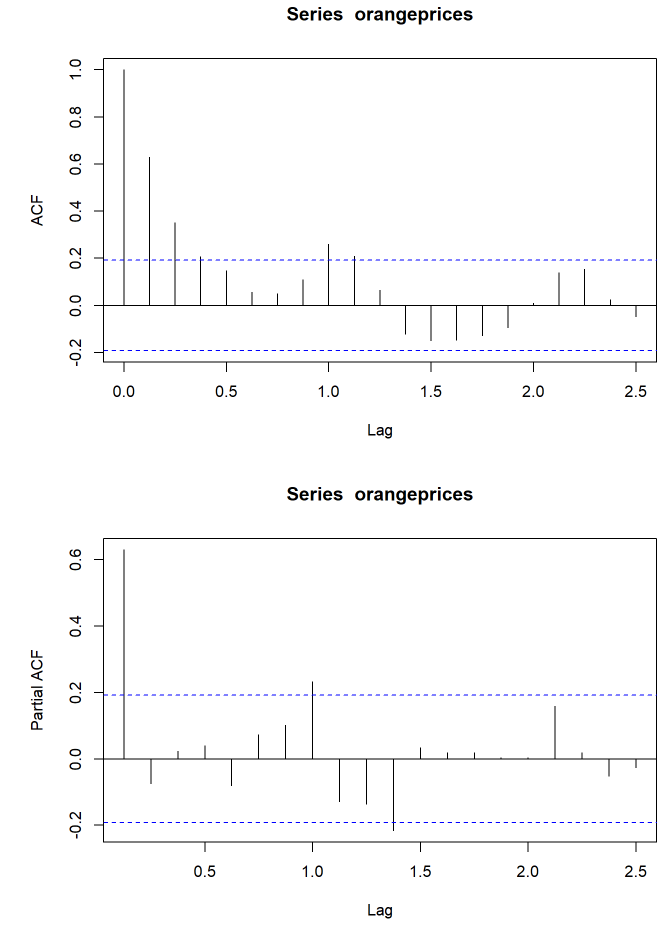
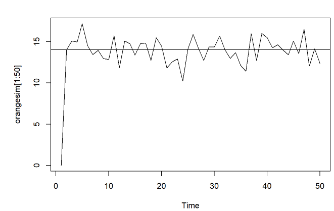

# Time Series Simulation
This project entailed analyzing why prices might be subject to periodic fluctuations and seeing if it is possible to model the next periods demand projection. The first Cob-Web model was dummy data generated with a normal distrubution. The second simulation models the price fluctation and seasonality of oranges.


## 1. Simulation of the Cob-Web model


```
{r cars}
equprice <- 14
phi <- -0.6
supplyshock <-rnorm(10000, 0, sqrt(.25))

nrep<-10000
y<-0
y1<-y

for (i in 2:nrep){
  y1[i]= equprice + phi*y1[i-1]* (supplyshock[i])
}

y1.ts <- ts(y1)

```

## 2. Simulation Model Plot


```{r pressure, echo=FALSE}

plot.ts(y1[1:50])
abline(h=mean(y1))
```



## 3. ACF and PACF Functions and Oberserved Patterns

It appears there is a big spike in the ACF for the first period but, then nothing much afterwards. In the PACF, there apears to be some alternating trend spiking up and down but not much relationship between the periods. There could be an explantation of some seasonality.

```{r acf, echo=FALSE}

acf(y1, lag.max = 10)
pacf(y1, lag.max = 10)
```



## 4. Oranges Price Model
This time series model starts from 1991 to 2004. The frequency is 8 as oranges only sell for 8 months of the year. 

```{r orange prices, echo=FALSE}

library(readxl)
data <- read_xls("Oranges(1).xls")
data <- na.omit(data)
orangeprices <- ts(data$Price_Oranges,frequency=8,start=1991)
orangeprices
```

## 5. Oranges Price Model Plot
There appears to be peaks and valleys in the time series plot of the data implying that the price of oranges flucates between months of the year.
```{r orange plot, echo=FALSE}

plot(orangeprices)
abline(h=mean(orangeprices))

```


## 6. Acf and Pacf of the price of Oranges

** The differences between these plots and the ones generated by the original time-series simulation. **

In the ACF plot, it appears that the there is some correlation between the previous periods wihin the first five periods. In the PACF plot, there is a big spike at the beginning and then it tends to taper off with some mid correlation around period 10. 

These plots differ signficantly because the ACF is only measuring the trend between the series and the lagged variables. The PACF is measuring instead the correlation of the residuals. We remove any found variation so it doesn't bias the next sample period.

```{r orange lot, echo=FALSE}
acf(orangeprices)
pacf(orangeprices)

```


## 7. Regression of Oranges

The suggested value of phi is 0.25401.

```{r orange ot, echo=FALSE}
neworanges <- diff(orangeprices)
lm.orange.model <- dynlm(neworanges~L(neworanges,-8))

```

## 8. Simulation with Phi value

```{r orange t, echo=FALSE}
equprice <- 14
phi <- .254
supplyshock <-rnorm(10000, 0, sqrt(.25))

nrep<-10000
op<-0
orangesim<-op
for (i in 2:nrep){
  orangesim[i]= equprice + phi*orangesim[i-1]* (supplyshock[i])
}


plot.ts(orangesim[1:50])
abline(h=mean(orangesim))

```


## 9. Oberservation ofPhi

The series appears to fluctuate less and appears to hug around the equprice fairly closely. The positive value of phi seems to show that it converges back to the mean. This postive vlaue of phi looks to condense the variation less than a negative phi.This positive phi may have helped to reduce the noise that was in the orginial simulation.


